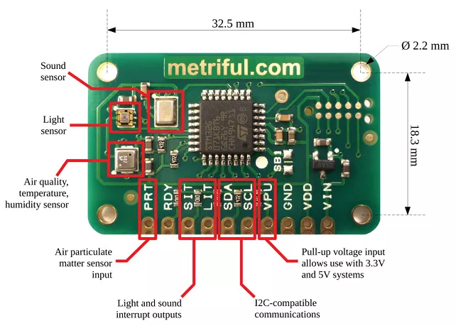

# Public-Environmental-Monitor

In this project, I utilized the Metriful MS430 sensor board and a Raspberry Pi 4b to moniotor various indorr environmental variables.

<t aligh = "center">© 2020 Metriful Ltd.

https://admin.tago.io/public/dashboard/5f0b358bbbca64001c768d0d/fed9d914-bb09-43f3-a171-f38501f29d74
https://sharp275.grafana.net/dashboard/snapshot/Q1mVUopp8ebjwyqZFnxlJmAXDIBwBSgj?orgId=1&refresh=5m
