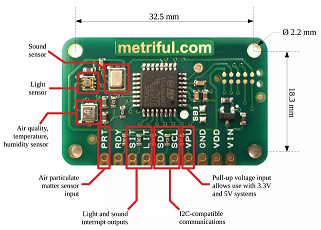

# Public-Version-Environmental-Monitor


In this project, I utilized the [Metriful MS430 sensor board](https://www.metriful.com/ms430) and a Raspberry Pi 4b to monitor various indoor environmental variables.  
The data is upload to both a time series database in [InfluxDB Cloud](https://www.influxdata.com/products/influxdb-cloud/) and to [Tago.IO](https://tago.io/), a cloud based solution for IoT.  Both of these have free tiers.  

<figure align="center">

<figcaption align = "center"><b>© 2020 Metriful Ltd.</b></figcaption>
</figure>


### **Description of Python Files**  
  

The [log_data_to_InfluxDB.py](log_data_to_InfluxDB.py) is a modification of the IoT cloud logging file supplied by Metriful Ltd.  This file requires the Python package influxdb-client installed.  
This can be installed by
```
pip install influxdb-client
```

The SDS011 particle sensor only has a lifetime about one year under continous operation and is costly for a personal project.  

Therefore, it is desrable to only have it run periodically.  The method given by Mertiful requires additional electronics I don't have easy access to obtain.  

The SDS011 does ship with a serial USB interface and this can utilized to not only obtain data but also set a working period.  

This means I needed to write a new Python script to obtain data from the SDS011 and send the data to InfluxDB Cloud and Tago.IO.  

The file for doing this is [Particle_Logging.py](Particle_Logging.py) and requires the [SDS011 python package](https://pypi.org/project/sds011/) installed.  

```
pip install sds011
```

### **Setting up Services**  
  

To ensure these Python files execute on restart and and if errors occur, I set them up to run as systemd services.  

Change to directory to create an unit file.

```
cd /lib/systemd/system/
```

Create the service.  

```
sudo nano your_service_name.service
```

Place the following text into file.  
```
[Unit]
Description=your custom description
After=multi-user.target

[Service]
Type=simple
ExecStart=/usr/bin/python /path_to_file/file.py
Restart=always
RestartSec=60

[Install]
WantedBy=multi-user.target

```  
Change the access permissions to python file to allow for it to be run with the following command.

```
sudo chmod +x /path_to_file/file.py
```
Creating a systemd service will ensure the Python files run after the system starts and restart after any errors.  Make sure the path to log_to_influxdb_cloud.py is correct.  

Use the following code to enable, start, and check the status of the service.

```
sudo systemctl daemon-reload
sudo systemctl enable your_service_name.service
sudo systemctl start your_service_name.service
sudo systemctl status your_service_name.service
```

Below is a link to a public version of one of my Tago.IO dashboards showing the current conditions in my home.  
[Tago.IO](https://5f07850bea86c1001c5c2ad7.run.tago.io)

<iframe width="800" height="600" src="https://embed.tago.io?widget=5f0b330c82da2b001c15d578&dashboard=5f0b330c82da2b001c15d576&token=d8da862e-fa08-4652-ad01-871c7ee4da15"/>


<iframe width="800" height="600" src="https://embed.tago.io?widget=5f0b330c82da2b001c15d579&dashboard=5f0b330c82da2b001c15d576&token=b15c782f-c8e9-410f-856f-bcfb88850ccf" frameborder="0" allowfullscreen />

<iframe width="800" height="600" src="https://embed.tago.io?widget=61202c11f055140018dd189e&dashboard=5f0b330c82da2b001c15d576&token=2d2efaca-58b7-4764-9124-f4f19603fa7c" frameborder="0" allowfullscreen />

<iframe width="800" height="600" src="https://embed.tago.io?widget=61f08a00ee930600185c1995&dashboard=5f0b330c82da2b001c15d576&token=1b0e88dd-903a-4468-b318-3486b04ae87b" frameborder="0" allowfullscreen />

<figure align="center">

</figure>
